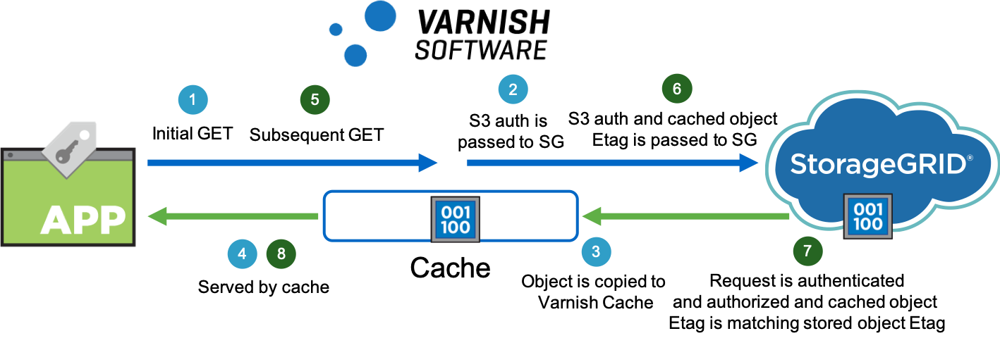

# Varnish caching for StorageGRID

## Introduction

Varnish Cache is a web application accelerator. When you place Varnish Cache in front of an application such as NetApp StorageGRID, the performance of objects that are repeatedly fetched is dramatically improved.

The initial fetch of an object from StorageGRID includes a small amount of latency that is inherent to object store architecture. With Varnish Cache in front of StorageGRID, all subsequent fetches of an object are served from Varnish Cache with low latency and high throughput.

The solution is designed to be completely transparent to any client and ensures that for all requests authentication and authorization is checked.



## Varnish lab configuration

For a proof of concept, we deployed a single Varnish Enterprise instance (commercial distribution) on a bare metal server:

- OS: Centos 7.6 
- 2 x 8 Core Intel(R) Xeon(R) CPU E5-2640 v2 @ 2.00GHz
- 192 GB Memory
- 8 x 512 GB NVMe disks
- Varnish Enterprise 6.0.4r1 (commercial distribution)

StorageGRID Configuration

- StorageGRID 11.2.0.2
- 6x virtual machine storage node, 4 x StorageGRID appliance SG5612, 4 x bare metal storage node
- Load balancer: Gateway node

WAN connection between Cache and S3 endpoint: 1GbE

Load generator used for benchmarks testing: [S3tester 2.1.0](https://github.com/s3tester/s3tester)

###	Varnish Installation

This solution was build and tested with Varnish Enterprise which is optimized for production usage and offers additional features relevant for this solution like the Varnish Massive Storage Engine (MSE) and SSL. MSE is optimized for caching using disk and memory.

**Note:** The VCL requires at least Varnish Enterprise 6.0.4r1 as some required bug fixes and features are only available since that release.

Follow the [installation steps provided by Varnish](https://docs.varnish-software.com/varnish-cache-plus/installation/) to install the software.

## Varnish Configuration

After you have installed Varnish, overwrite the default configuration file.

### Provide StorageGRID custom VCL

To provide the StorageGRID custom VCL, complete the following steps:

1. Replace `/etc/varnish/default.vcl` with the StorageGRID VCL file. Use the [`default.vcl`](default.vcl) file on GitHub as a basis.
2. Customize the default.vcl file to point to your grid:
    1. Provide the DNS name of your load balancer or Gateway node.
    2. Provide the port:
        * 8082 is the default port for API Gateway Node HTTPS.

### Configure Massive Storage Engine (MSE)

For best performance, NetApp recommends using memory and SSD or NVMe drives for caching. To configure the MSE, complete the following steps:

1. Follow the [steps provided by Varnish to configure MSE](https://docs.varnish-software.com/varnish-cache-plus/features/mse/). An example [`mse.conf`](mse.conf) file is provided on GitHub. 
2. Copy the `mse.conf` file to `/var/lib/mse/mse.conf` and customize it for your environment.

**Note:** Note:	Configure the `database_size` parameter to account for 100 bytes per object cached. Store the database directory on low latency storage or it can negatively impact small object throughput.

3. Initialize your MSE configuration using `mkfs.mse -f -c /var/lib/mse/mse.conf`.

### Configure Hitch to use your SSL certificate

To configure Hitch to use your SSL certificate, complete the following steps:

1. Follow the steps provided by Varnish for [setting up Client SSL/TLS termination](https://docs.varnish-software.com/varnish-cache-plus/features/client-ssl/).
2. Provide the SSL certificate that matches the DNS name of your StorageGRID S3 endpoint.
3. Copy your SSL certificate in PEM format to `/etc/hitch`
4. Modify `/etc/hitch/hitch.conf`
5. Set front end to desired port:

```
frontend = {
    host = "*"
    port = "443"
```

6. Hitch requires a single file containing the concatenation of private key, certificate and CA certificate(s). From the certificate and private key used in StorageGRID for the Object Storage endpoint, you can concatenate them with

```
cat example.key example.crt ca.crt > example.pem
```

7. Make sure to either copy the file to the default location, which is `/etc/hitch/testcert.pem` or change the default location in `/etc/hitch/hitch.conf` to the match the location of the PEM file.

```
pem-file = "/etc/hitch/example.pem"
```

### Restart services and test

To restart services and test, complete the following steps:

1. Configure Varnish to listen on the port of your choice. Hitch requires Varnish to listen on port 8443 for the PROXY protocol, which can be achieved with the parameter `-a :8443,PROXY`. If HTTP access should be allowed, also use the parameter `-a :80`.
2. Make sure that the following settings are included:
```
vsl_mask=+Hash
http_gzip_support=off
```

The first setting adds the hash to the logging to simplify debugging. The second disables gzip which would break S3 authentication if enabled. 

See the following example of Varnish parameters:

```
/usr/sbin/varnishd -F -a :80 -a :8443,PROXY -s mse,/var/lib/mse/mse.conf -p vsl_mask=+Hash -p http_gzip_support=off -f /etc/varnish/default.vcl
```

3. Start or restart the Varnish and Hitch services.

Now you can fetch an object from StorageGRID through Varnish by using any S3 client.

## Docker deployment

To simplify testing and to provide a working setup to start from, this repository contains a docker-compose example.

**Note**: To use this setup, you need docker and docker-compose to be available.

Then run the following steps:

Clone the GitHub repository

```
git clone https://github.com/NetApp-StorageGRID/varnish.git
```

Change to the varnish directory

```
cd varnish
```

Create a RHEL/Centos yum repository file to access the Varnish Enterprise files (contact Varnish for a trial or purchase of Varnish Enterprise):

```
vi varnish-6.0-plus.repo
```

Modify the default.vcl and mse.conf files according to your setup. As a minimum, change the endpoint in vcl_init in default.vcl and provide directory and filename for the books in mse.conf.

Then run the container using docker-compose. You may want to use the `--build` paramater to recreate the Docker image, if you changed default.vcl or mse.conf.

```
docker-compose up --build
```